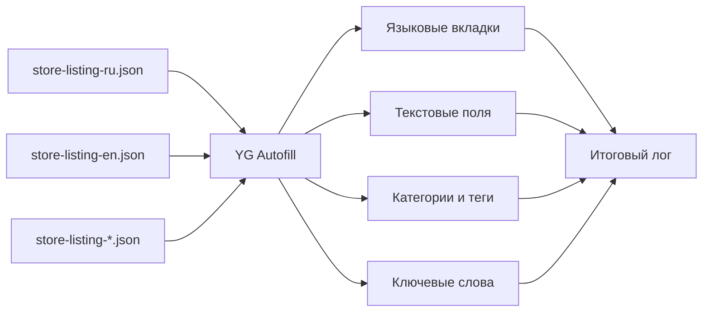

<div align="center">

# YG Autofill

**Автозаполнение карточки игры в консоли Яндекс Игр из JSON**

Загружает локализации, заполняет текстовые поля, категории, теги и ключевые слова, автоматически учитывает лимиты и сохраняет подробный журнал выполнения.

[](CHANGELOG.md)
[](https://github.com/Nioris/yg-autofill/actions/workflows/validate.yml)
[](LICENSE)
[](yg-autofill.js)
[](https://yandex.ru/games/)

[Быстрый старт](#быстрый-старт) · [Формат JSON](docs/JSON_FORMAT.md) · [Пример JSON](examples/store-listing-ru.json) · [Диагностика](docs/TROUBLESHOOTING.md) · [Changelog](CHANGELOG.md)

</div>

> [!IMPORTANT]
> YG Autofill — независимый инструмент. Проект не является официальным продуктом Яндекса и не связан с Яндексом.

## Зачем это нужно

При публикации игры с несколькими локализациями одни и те же поля приходится заполнять вручную для каждого языка. YG Autofill переносит данные из подготовленных `store-listing-*.json` прямо в открытую форму черновика.

Скрипт работает локально в браузере и добавляет небольшую панель поверх страницы. Он не нажимает «Сохранить» и не отправляет игру на модерацию — финальная проверка и сохранение остаются за пользователем.

## Возможности

- загрузка одного или нескольких языковых JSON-файлов;
- автоматическое добавление и переключение языковых вкладок;
- заполнение названия, SEO-описания, полного и короткого описания, инструкции «Как играть»;
- опциональное заполнение категорий, тегов и ключевых слов;
- автоматическое обрезание текста до фактического лимита поля;
- итоговый отчёт: что заполнено, что обрезано и где произошли ошибки;
- выбор категорий и тегов только по точному совпадению;
- проверка доступности полей страницы до запуска;
- встроенный лог с уровнями `INFO`, `OK`, `WARN`, `ERROR`, `DEBUG`;
- копирование и сохранение журнала в TXT;
- резервный поиск элементов по App ID, `id`, `name`, `aria-label`, селекторам и видимым подписям.

## Быстрый старт

1. Откройте страницу черновика игры в консоли Яндекс Игр.
2. Откройте DevTools → **Console**.
3. Откройте [`yg-autofill.js`](yg-autofill.js), скопируйте файл целиком и вставьте его в консоль.
4. Нажмите **«Загрузить store-listing-*.json»**.
5. Выберите один или несколько JSON-файлов.
6. При необходимости включите **Категории**, **Теги** и **Ключевые слова**.
7. Нажмите **«Проверить поля страницы»**.
8. Нажмите **«Заполнить все языки»**.
9. Проверьте итоговый лог и саму форму.
10. Сохраните изменения вручную в интерфейсе Яндекс Игр.

Подробная пошаговая инструкция: [`docs/USAGE.md`](docs/USAGE.md).

## Как это работает



Для каждого языка скрипт переключается на соответствующую вкладку, находит поля текущей версии интерфейса, определяет ограничения и записывает значения через нативные события формы.

## Что заполняется

| Ключ JSON | Поле в консоли | Тип | Резервный лимит | Поведение |
|---|---|---|---:|---|
| `title` | Название игры | строка | 50 | Заполняется; лишнее обрезается с конца |
| `seo_description` | Описание для SEO | строка | 160 | Заполняется; лишнее обрезается с конца |
| `about` | Об игре / Описание игры | строка | 1000 | Заполняется; лишнее обрезается с конца |
| `subtitle` | Короткое описание | строка | 70 | Поддерживается также `short_description` |
| `how_to_play` | Как играть | строка | 1000 | Заполняется; лишнее обрезается с конца |
| `category` | Категории | строка / массив | список Яндекса | Добавляются только точные совпадения; также `categories` |
| `tags` | Теги | строка / массив | список Яндекса | Добавляются только точные совпадения |
| `keywords` | Ключевые слова | строка / массив | 100 | Массив объединяется через `, `; лишнее обрезается |

Сначала YG Autofill пытается определить реальный лимит непосредственно из формы Яндекс Игр. Значения в таблице используются как резервные.

Если текст пришлось обрезать, это **не скрывается**. В итоговом журнале будет указано поле, исходная длина, итоговая длина и число удалённых символов.

Пример:

```text
ОБРЕЗАНО ПРИ ЗАПОЛНЕНИИ:
— Русский → Описание игры: 1085→1000
  срезано 85 символов
```

## Формат JSON

Рекомендуемое имя файла:

```text
store-listing-ru.json
store-listing-en.json
store-listing-de.json
```

Минимальный вариант:

```json
{
  "lang": "ru",
  "title": "Название игры",
  "subtitle": "Короткое описание игры",
  "seo_description": "Описание для поисковых систем.",
  "about": "Полное описание игры.",
  "how_to_play": "Объяснение управления и правил."
}
```

Полный вариант:

```json
{
  "lang": "ru",
  "title": "Название игры",
  "subtitle": "Короткое описание",
  "category": [
    "Казуальные",
    "Экономические"
  ],
  "tags": [
    "тапалки",
    "с прокачкой"
  ],
  "keywords": [
    "кликер",
    "машины",
    "завод"
  ],
  "seo_description": "Описание для поисковых систем.",
  "about": "Полное описание игры.",
  "how_to_play": "Правила и управление."
}
```

Полный живой пример: [`examples/store-listing-ru.json`](examples/store-listing-ru.json).

Чистый шаблон: [`examples/store-listing-template.json`](examples/store-listing-template.json).

Формальная JSON Schema: [`schema/store-listing.schema.json`](schema/store-listing.schema.json).

Подробное описание каждого ключа, типов и альтернативных имён: [`docs/JSON_FORMAT.md`](docs/JSON_FORMAT.md).

## Языки

Код языка берётся прежде всего из поля `lang` внутри JSON. Если его нет, скрипт пытается определить язык по имени файла.

Поддерживаются:

`ru` · `en` · `es` · `pt` · `tr` · `de` · `fr` · `it` · `ja` · `ko` · `zh` · `ar` · `hi` · `id`

Если один язык загружен несколько раз, используются данные последнего загруженного файла.

Категории, теги и ключевые слова являются общими полями карточки. Для них используется русский JSON (`lang: "ru"`), а если русского файла нет — первый загруженный JSON.

## Категории и теги

Категории и теги в интерфейсе Яндекс Игр — не обычные текстовые поля. YG Autofill вводит значения по одному и подтверждает только **точное совпадение** из выпадающего списка.

Например, если в JSON указано:

```json
"tags": ["машины"]
```

а точного варианта `машины` в списке Яндекса нет, инструмент не выберет похожий тег автоматически. Ошибка будет записана в журнал.

Это сделано специально, чтобы скрипт не подставлял неправильные категории или теги без ведома пользователя.

## Автообрезка и лимиты

Если значение длиннее разрешённого, YG Autofill:

1. определяет допустимый максимум;
2. срезает лишние символы **с конца**;
3. заполняет поле допустимым значением;
4. проверяет, что интерфейс принял изменение;
5. добавляет запись в итоговый отчёт.

Многоточие автоматически не добавляется, чтобы не отнимать дополнительные символы у лимита.

## Журнал программы

Лог доступен прямо в панели YG Autofill и одновременно дублируется в Console с префиксом `[YG]`.

Уровни:

| Уровень | Значение |
|---|---|
| `INFO` | обычный ход выполнения |
| `OK` | операция выполнена успешно |
| `WARN` | действие выполнено, но есть важное замечание |
| `ERROR` | поле или операция не выполнены |
| `DEBUG` | техническая диагностическая информация |

Журнал можно показать/скрыть, скопировать, очистить и скачать как `.txt`.

Подробнее: [`docs/LOGGING.md`](docs/LOGGING.md).

## Проверка JSON из командной строки

В репозитории есть валидатор без внешних зависимостей:

```bash
python tools/validate_json.py examples/store-listing-ru.json
```

Для нескольких файлов:

```bash
python tools/validate_json.py store-listing-*.json
```

Структурные ошибки дают ненулевой код завершения. Превышение текстового лимита считается предупреждением, потому что YG Autofill умеет безопасно обрезать значение при заполнении.

## Если что-то не работает

Сначала:

1. нажмите **«Проверить поля страницы»**;
2. повторите заполнение;
3. откройте **«Показать лог»**;
4. сохраните или скопируйте журнал.

Типовые проблемы и способы диагностики описаны в [`docs/TROUBLESHOOTING.md`](docs/TROUBLESHOOTING.md).

Если интерфейс Яндекс Игр изменился, лог обычно позволяет понять, какой именно элемент больше не находится или какое значение отклонено формой.

## Безопасность

Код, вставленный в DevTools Console, выполняется с правами открытой страницы. Перед запуском проверяйте источник файла и изменения в коде.

YG Autofill не содержит собственных сетевых запросов для передачи данных проекта наружу. JSON читается локально в браузере, после чего скрипт взаимодействует с уже открытой страницей консоли Яндекс Игр.

Подробнее: [`SECURITY.md`](SECURITY.md).

## Документация

| Документ | Содержание |
|---|---|
| [`docs/USAGE.md`](docs/USAGE.md) | подробная инструкция по запуску и заполнению |
| [`docs/JSON_FORMAT.md`](docs/JSON_FORMAT.md) | полный формат `store-listing-*.json` |
| [`docs/ARCHITECTURE.md`](docs/ARCHITECTURE.md) | устройство скрипта и поиск элементов формы |
| [`docs/LOGGING.md`](docs/LOGGING.md) | журнал, уровни и итоговые отчёты |
| [`docs/TROUBLESHOOTING.md`](docs/TROUBLESHOOTING.md) | диагностика проблем |
| [`CHANGELOG.md`](CHANGELOG.md) | история изменений |
| [`CONTRIBUTING.md`](CONTRIBUTING.md) | правила участия в разработке |
| [`SECURITY.md`](SECURITY.md) | рекомендации по безопасности |

## Структура репозитория

```text
yg-autofill/
├── yg-autofill.js
├── README.md
├── CHANGELOG.md
├── CONTRIBUTING.md
├── SECURITY.md
├── LICENSE
├── NOTICE
├── examples/
│   ├── store-listing-ru.json
│   └── store-listing-template.json
├── schema/
│   └── store-listing.schema.json
├── tools/
│   └── validate_json.py
└── docs/
    ├── USAGE.md
    ├── JSON_FORMAT.md
    ├── ARCHITECTURE.md
    ├── LOGGING.md
    └── TROUBLESHOOTING.md
```

## Автор и лицензия

Автор проекта: **Aleksandr Krasnokutskiy**.

Проект разработан в **Rodrik LTD** — [rodrik.dev](https://rodrik.dev).

YG Autofill распространяется по **Apache License 2.0**. При распространении производных версий необходимо сохранять применимые уведомления из [`NOTICE`](NOTICE).

Полный текст лицензии: [`LICENSE`](LICENSE).

---

<div align="center">

**YG Autofill v12.0** · Rodrik LTD · Aleksandr Krasnokutskiy

</div>
